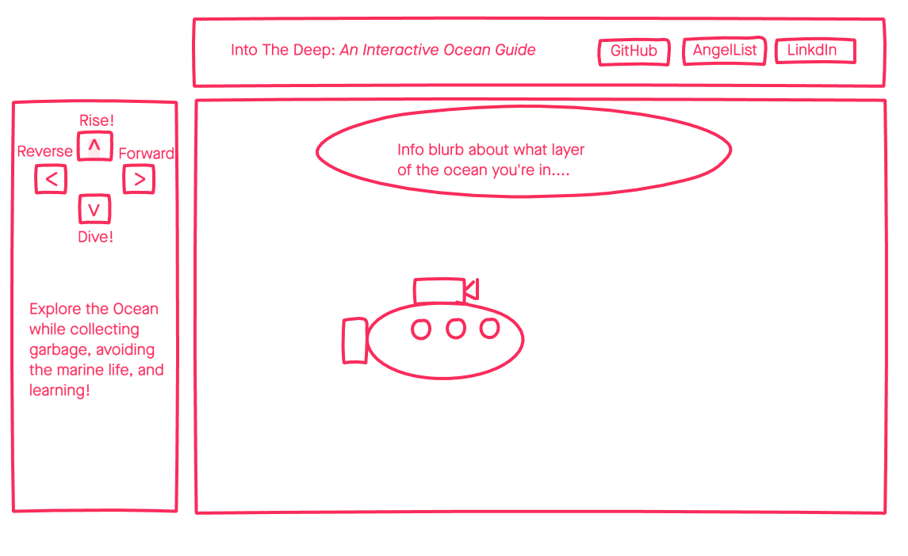

# into-the-deep

## Background
Into The Deep is an ocean exploration game, where you, the submarine dive through the different layers of the ocean. Along the way you will learn about the different zones while encountering garbage (which you move over to collect). As you go deeper the light will diminish making it harder to see.

## MVP/Functionality
* Reactive background based on depth
* Garbage that appears/ is able to be collected
* "Infinite" scroll in the vertical axis
* Depth gauge and depth arrow that corresponds on canvas to location
* Deploy on Heroku

## Wireframes

## Architecture/Technologies
* Javascript for game logic
* Webpack
* Canvas

## Future Features
* Animated Marine Life
